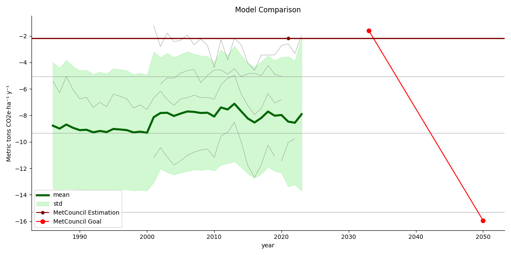

# HennepinCarbon

The current repo contains carbon storage and sequestration analysis for Hennepin County, MN, USA. The analysis was done by converting different methologies into one time series and comparing them with the current MetCouncil estimation and Hennepin Climate Action Plan.

## Datasets

1. NorthFlux [1]
2. FLUXCOM [2]
3. Landsat NPP [3]
4. MODIS NPP [4]
5. MiCASA [5]
6. MetCouncil [6]
7. Look up table sources be added ...

## Contributors
Aleksei Rozanov
